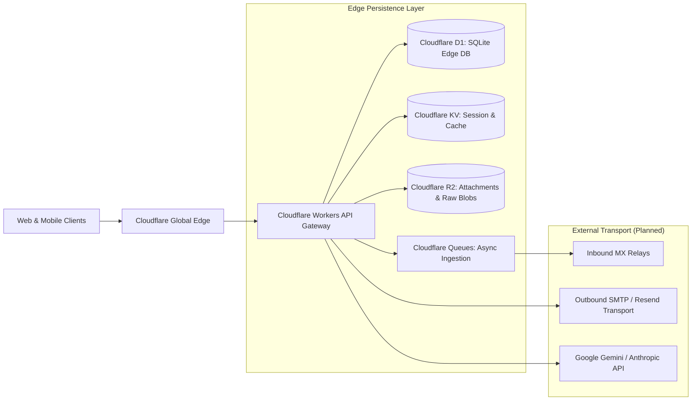

# Oryol Backend Architecture & Cloudflare Edge Services

The production backend architecture for Oryol Workspace is designed for low latency, zero cold starts, and global multi-tenant scalability leveraging Cloudflare Edge Infrastructure.

---

## 1. Production Backend Topology

---

## 2. Stateless Execution & Tenant Scoping

- **Stateless Workers**: API endpoints run as lightweight edge functions.
- **Header Propagation**: The gateway extracts and validates JWT tokens, populating tenant context (`ctx.orgId`, `ctx.userId`, `ctx.membershipId`).
- **Database Connection**: Queries execute against organization-partitioned D1 relational databases with bound parameterized statements.
- **Asset Offloading**: Large file attachments are streamed directly to Cloudflare R2 using pre-signed organization-prefixed URLs.
