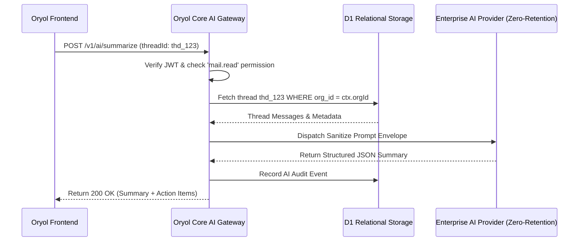

# Oryol Core — Technical Architecture Specification

**System**: `serlekan/oryol-core`  
**Ecosystem**: Oryol Workspace Platform  
**Target Runtime**: Cloudflare Edge Infrastructure (Workers + D1 + KV + R2 + Queues)  
**Status**: Architecture Plan (Pre-Implementation Baseline)

---

## Executive Architectural Summary

`oryol-core` is the foundational multi-tenant identity, access control, audit, notification, and AI governance backbone for the entire Oryol Workspace ecosystem. It provides the centralized platform layer consumed by **OryolMail**, **Oryol CRM**, **Oryol Calendar**, **Oryol Drive**, and **Virel**.

```
┌───────────────────────────────────────────────────────────────────────────────────┐
│                                 Oryol Applications                                │
│   ┌──────────────┐ ┌──────────────┐ ┌────────────────┐ ┌────────────┐ ┌────────┐  │
│   │  OryolMail   │ │  Oryol CRM   │ │ Oryol Calendar │ │Oryol Drive │ │ Virel  │  │
│   └──────┬───────┘ └──────┬───────┘ └────────┬───────┘ └─────┬──────┘ └───┬────┘  │
└──────────┼────────────────┼──────────────────┼───────────────┼────────────┼───────┘
           ▼                ▼                  ▼               ▼            ▼
┌───────────────────────────────────────────────────────────────────────────────────┐
│                                    oryol-core                                     │
│  ┌───────────────┐ ┌───────────────┐ ┌───────────────┐ ┌────────────────────────┐  │
│  │   Identity    │ │ Organization  │ │  Permissions  │ │      Audit Stream      │  │
│  │  & Auth Edge  │ │  & Membership │ │  RBAC Engine  │ │     (Immutable)        │  │
│  └───────────────┘ └───────────────┘ └───────────────┘ └────────────────────────┘  │
│  ┌─────────────────────────────────┐ ┌──────────────────────────────────────────┐  │
│  │      Notification Pipeline      │ │       Permission-Aware AI Gateway        │  │
│  │     (WS / Push / SSE / Toasts)  │ │      (Zero-Retention Model Router)       │  │
│  └─────────────────────────────────┘ └──────────────────────────────────────────┘  │
└───────────────────────────────────────────────────────────────────────────────────┘
                                         │
                                         ▼
┌───────────────────────────────────────────────────────────────────────────────────┐
│                         Cloudflare Edge Infrastructure                            │
│  ┌───────────────┐ ┌───────────────┐ ┌───────────────┐ ┌────────────────────────┐  │
│  │ Cloudflare D1 │ │ Cloudflare KV │ │ Cloudflare R2 │ │   Cloudflare Queues    │  │
│  │  (Relational) │ │(Session/Cache)│ │ (Blob Storage)│ │   (Async Ingestion)    │  │
│  └───────────────┘ └───────────────┘ └───────────────┘ └────────────────────────┘  │
└───────────────────────────────────────────────────────────────────────────────────┘
```

---

## 1. Identity & Authentication Architecture

Oryol Workspace enforces **single-source global identity**. Individual applications never maintain local user tables or custom authentication schemes.

### 1.1 Account vs. Membership Separation

```text
Global User (usr_...) ─────────── Holds credentials, global profile, MFA keys
       │
       ├──► Membership (mem_orgA) ──► Org A (Role: Admin, Perms: mail.*, crm.*)
       └──► Membership (mem_orgB) ──► Org B (Role: Member, Perms: mail.read)
```

- **Global User (`usr_...`)**: Identity record storing email, phone, WebAuthn/Passkey public keys, password hash (Argon2id), global display name, and avatar URL.
- **Organization Membership (`mem_...`)**: Tenant-scoped relationship containing the user's role, permissions, status (`active`, `invited`, `suspended`), custom title, and assigned aliases.

### 1.2 Authentication Methods

1. **Passkeys / WebAuthn (Primary)**: FIDO2 hardware/biometric authentication handled at the edge via WebAuthn challenge-response.
2. **Magic Link / OTP**: Cryptographically signed, short-lived tokens (10-minute validity) dispatched via transactional relay.
3. **Enterprise SAML 2.0 / OIDC SSO**: Federated identity mapping corporate IdPs (Okta, Azure AD, Google Workspace) directly to organization memberships.

### 1.3 Token Lifecycle & Edge Cryptography

Authentication issues a two-tier token structure:

1. **Workspace Refresh Token**:
   - Long-lived (30 days with sliding window), stored in `httpOnly`, `Secure`, `SameSite=Strict` cookies.
   - Stored in Cloudflare KV with device/session fingerprinting for instant global revocation.
2. **Scoped Organization Session JWT**:
   - Short-lived (15 minutes), issued when a user selects or switches their active Organization.
   - Signed using asymmetric `EdDSA` (Ed25519) keys rotated periodically.
   - Verified at Cloudflare Workers edge nodes in `< 1ms` without database queries.

#### Session JWT Claims Payload:
```json
{
  "iss": "https://auth.oryol.com",
  "sub": "usr_01H8Z7A2B3C4D5E6F7G8H9J0K1",
  "org_id": "org_01H8Z7B5C6D7E8F9G0H1J2K3L4",
  "mem_id": "mem_01H8Z7C8D9E0F1G2H3J4K5L6M7",
  "email": "sarah@oryolhq.com",
  "role": "admin",
  "perms": [
    "mail.read",
    "mail.send",
    "mail.manage",
    "crm.deal.manage",
    "domain.manage"
  ],
  "exp": 1756150200,
  "nbf": 1756149300,
  "iat": 1756149300,
  "jti": "tok_01H8Z7D1E2F3G4H5J6K7L8M9N0"
}
```

---

## 2. Organization Model

The **Organization (`org_...`)** is the absolute tenant boundary. Every business object in every application belongs to an organization.

### 2.1 Organization Attributes & Capabilities

- **Unique Slug & Name**: `slug` (e.g. `acme-corp`) used for subdomains and API routing.
- **Subscription Tier**: `free`, `starter`, `business`, `enterprise` defining resource allocations.
- **Resource Quotas**: Mailbox limits, custom domain caps, shared inbox counts, AI token allotments, and R2 storage pools.
- **Security Policies**:
  - `enforce_mfa`: Boolean requiring all members to configure Passkeys/2FA.
  - `ip_allowlist`: CIDR blocks restricting API and webmail access.
  - `session_duration_minutes`: Configurable idle timeout.
  - `data_retention_days`: Automated purge schedules for compliance.

### 2.2 Custom Domains & DNS Routing

- Organizations own custom domains (`dom_...`).
- Verification is performed centrally by `oryol-core` (verifying MX, SPF, DKIM 2048-bit CNAMEs, DMARC TXT records).
- Verified domains become available for email aliases in OryolMail, branded links in Oryol Drive, and calendar booking pages.

---

## 3. Membership & Access Delegation Model

Users never interact with an application directly as an unattached individual; they act through their **Membership**.

### 3.1 Membership Lifecycle States

```text
[Invite Dispatched] ──► pending_invite
                              │
                    ┌─────────┴─────────┐
                    ▼                   ▼
              [Accepted]           [Declined]
                    │                   │
                    ▼                   ▼
                 active              rejected
                    │
            ┌───────┴───────┐
            ▼               ▼
        suspended        removed
```

### 3.2 Standard Organization Roles

| Role | Hierarchy Rank | Intended Use | Default Capabilities |
|---|---|---|---|
| **Owner** | 100 | Organization Creator / Legal Admin | Full control, billing, ownership transfer, organization deletion |
| **Admin** | 80 | IT / Operations Leads | Member management, domain verification, global mailbox management |
| **Member** | 50 | Standard Employee | Personal mailbox, assigned shared inboxes, CRM/Calendar access |
| **Guest** | 10 | External Contractor / Partner | Restricted to specifically shared folders, deals, or calendar events |

---

## 4. Universal Permission System (RBAC + Scopes)

Oryol Core implements a uniform, cross-product permission taxonomy.

### 4.1 Dot-Notation Permission Namespaces

```
<application_or_domain>.<resource>.<action>
```

#### Core Platform Permissions (`core.*`):
- `core.org.view`, `core.org.edit`, `core.org.delete`
- `core.members.invite`, `core.members.edit`, `core.members.remove`
- `core.domains.create`, `core.domains.verify`, `core.domains.delete`
- `core.billing.view`, `core.billing.manage`
- `core.audit.view`, `core.audit.export`

#### OryolMail Permissions (`mail.*`):
- `mail.read`: Read emails in personal/assigned mailboxes.
- `mail.send`: Dispatch emails from authorized sender aliases.
- `mail.shared.read`: Access shared team mailboxes (`support@`, `sales@`).
- `mail.shared.assign`: Assign conversation threads and author internal notes.
- `mail.manage`: Create aliases, rules, filters, and auto-responders.
- `mail.delete`: Permanently delete email threads.

#### Oryol CRM Permissions (`crm.*`):
- `crm.contacts.read`, `crm.contacts.write`, `crm.contacts.delete`
- `crm.deals.read`, `crm.deals.manage`, `crm.pipeline.configure`
- `crm.export`: Export customer databases (sensitive).

#### Oryol Calendar Permissions (`calendar.*`):
- `calendar.read`, `calendar.write`, `calendar.share`, `calendar.manage`

#### Oryol Drive Permissions (`drive.*`):
- `drive.read`, `drive.write`, `drive.share`, `drive.admin`

#### Virel Permissions (`virel.*`):
- `virel.synthesize`: Run cross-application intelligence queries.
- `virel.automate`: Configure automated background triggers and webhooks.

### 4.2 Edge Permission Evaluation Engine

```typescript
export function hasPermission(
  membershipPermissions: string[],
  requiredScope: string
): boolean {
  if (membershipPermissions.includes('*') || membershipPermissions.includes('admin.*')) {
    return true;
  }
  if (membershipPermissions.includes(requiredScope)) {
    return true;
  }
  // Check wildcard prefix e.g. "mail.*" satisfies "mail.read"
  const [app, resource] = requiredScope.split('.');
  return membershipPermissions.includes(`${app}.*`) || 
         membershipPermissions.includes(`${app}.${resource}.*`);
}
```

---

## 5. Audit & Compliance Architecture

Every sensitive, state-mutating, or authorization-altering action generates an immutable audit record.

### 5.1 Non-Bypassable Middleware Flow

```text
Incoming API Request
       │
       ▼
Edge Gateway Auth Middleware ──► Extract JWT (User, Org, Membership, IP)
       │
       ▼
Business Operation Execution (e.g. Delete Mailbox, Verify Domain, Export CRM)
       │
       ▼
Audit Interceptor ──► Emit Audit Payload to Cloudflare Queue (Non-blocking)
       │
       ▼
Worker Consumer ──► Batch Insert into D1 `audit_events` + Cold Archive to R2
```

### 5.2 Audit Event Schema

```typescript
export interface AuditEvent {
  eventId: string;              // aud_<ulid>
  timestamp: string;            // ISO-8601 UTC
  organizationId: string;       // org_<ulid>
  actor: {
    userId: string;             // usr_<ulid>
    membershipId: string;       // mem_<ulid>
    email: string;
    ipAddress: string;
    userAgent: string;
  };
  action: string;               // e.g. "domain.verify", "mail.alias.created"
  resource: {
    type: string;               // "domain", "mailbox", "deal", "member"
    id: string;                 // e.g. "dom_01H8Z..."
    name?: string;
  };
  details: {
    before?: Record<string, unknown>;
    after?: Record<string, unknown>;
    metadata?: Record<string, unknown>;
  };
  status: 'success' | 'denied' | 'error';
}
```

---

## 6. Real-Time Notification Pipeline

A centralized real-time notification engine serves all Oryol applications.

### 6.1 Architecture Overview

```text
App Event (e.g. New Email, Assigned Ticket, Deal Won, Calendar Invite)
       │
       ▼
Notification Service (`POST /v1/notifications/emit`)
       │
       ├─► 1. Evaluate User Notification Preferences & Quiet Hours
       ├─► 2. Persist to D1 `notifications` table
       ├─► 3. Broadcast to Cloudflare Durable Object (WebSocket Hub)
       └─► 4. Fallback to Web Push / Mobile Push if Offline
```

### 6.2 Notification Data Model

- `id`: `ntf_<ulid>`
- `organizationId`: `org_<ulid>`
- `recipientUserId`: `usr_<ulid>`
- `category`: `email` | `shared_inbox` | `crm` | `calendar` | `system`
- `priority`: `low` | `standard` | `high` | `urgent`
- `title`: Short title
- `body`: Markdown/Plain text snippet
- `actionUrl`: Relative deep link (e.g. `/mail/thread/thd_4892`)
- `isRead`: Boolean
- `createdAt`: ISO-8601 UTC

---

## 7. Permission-Aware AI Gateway Architecture

The AI Gateway provides a managed, secure, zero-retention bridge to foundation models (Google Gemini, Anthropic Claude, OpenAI).

### 7.1 Security & Permission Constraints

1. **Pre-flight Authorization**:
   - The Gateway intercepts every prompt request.
   - It checks `ctx.hasPermission('mail.read')` before allowing email thread ingestion.
   - It checks `ctx.hasPermission('crm.contacts.read')` before allowing contact summarization.
2. **Strict Organization Sandboxing**:
   - Cross-organization RAG or vector retrieval is strictly barred by partitioning index namespaces by `org_<id>`.
3. **Zero Third-Party Training**:
   - Headers enforce zero-data retention on all commercial AI provider APIs.
4. **Structured JSON Output**:
   - Responses conform to validated JSON schemas (`SummarizeResponse`, `DraftReplyResponse`, `DnsTroubleshootResponse`).
5. **AI Attribution in Audit Log**:
   - AI-assisted operations log token usage, model version, and the initiating user ID.



---

## 8. Multi-Tenant Boundaries & Storage Isolation

| Layer | Storage Technology | Partitioning & Isolation Mechanism |
|---|---|---|
| **Relational Data** | Cloudflare D1 (SQLite Edge) | Mandatory `organization_id` column in all tables. Every parameterized query enforces `WHERE organization_id = ?`. Unscoped queries are rejected by static linting. |
| **Object Storage** | Cloudflare R2 | Keys strictly namespaced: `/org_{org_id}/{app}/{entity_type}/{id}/{filename}`. Pre-signed upload/download URLs expire in `< 15 minutes` and require active membership tokens. |
| **Sessions & KV** | Cloudflare KV | Keys prefixed with `org:{org_id}:` or `usr:{user_id}:`. |
| **Async Tasks & Queues** | Cloudflare Queues | Message envelopes include `org_id` and trace context. Workers validate organization existence before executing background jobs. |

---

## 9. Relational Database Schema Design (Cloudflare D1)

```sql
-- ============================================================================
-- 1. GLOBAL IDENTITY & SESSIONS
-- ============================================================================

CREATE TABLE users (
    id TEXT PRIMARY KEY,                       -- usr_<ulid>
    email TEXT UNIQUE NOT NULL,
    display_name TEXT NOT NULL,
    avatar_url TEXT,
    is_active INTEGER NOT NULL DEFAULT 1,
    created_at DATETIME DEFAULT CURRENT_TIMESTAMP,
    updated_at DATETIME DEFAULT CURRENT_TIMESTAMP
);

CREATE TABLE user_credentials (
    user_id TEXT PRIMARY KEY,                  -- usr_<ulid>
    password_hash TEXT,                        -- Argon2id hash (if password enabled)
    webauthn_credentials TEXT,                 -- JSON array of registered FIDO2 public keys
    mfa_secret TEXT,                           -- TOTP secret (encrypted)
    mfa_enabled INTEGER NOT NULL DEFAULT 0,
    updated_at DATETIME DEFAULT CURRENT_TIMESTAMP,
    FOREIGN KEY (user_id) REFERENCES users(id) ON DELETE CASCADE
);

CREATE TABLE user_sessions (
    id TEXT PRIMARY KEY,                       -- ses_<ulid>
    user_id TEXT NOT NULL,
    active_organization_id TEXT,
    refresh_token_hash TEXT NOT NULL,
    user_agent TEXT,
    ip_address TEXT,
    expires_at DATETIME NOT NULL,
    created_at DATETIME DEFAULT CURRENT_TIMESTAMP,
    FOREIGN KEY (user_id) REFERENCES users(id) ON DELETE CASCADE
);

-- ============================================================================
-- 2. ORGANIZATIONS & MEMBERSHIPS
-- ============================================================================

CREATE TABLE organizations (
    id TEXT PRIMARY KEY,                       -- org_<ulid>
    name TEXT NOT NULL,
    slug TEXT UNIQUE NOT NULL,
    plan TEXT NOT NULL DEFAULT 'starter',       -- 'free', 'starter', 'business', 'enterprise'
    settings TEXT NOT NULL DEFAULT '{}',       -- JSON: MFA enforcement, IP allowlist, retention
    created_at DATETIME DEFAULT CURRENT_TIMESTAMP,
    updated_at DATETIME DEFAULT CURRENT_TIMESTAMP
);

CREATE TABLE organization_domains (
    id TEXT PRIMARY KEY,                       -- dom_<ulid>
    organization_id TEXT NOT NULL,
    domain TEXT UNIQUE NOT NULL,
    status TEXT NOT NULL DEFAULT 'pending',     -- 'verified', 'pending', 'failed'
    dns_records TEXT NOT NULL DEFAULT '[]',    -- JSON array of MX, TXT, CNAME records
    dkim_selector TEXT,
    verified_at DATETIME,
    created_at DATETIME DEFAULT CURRENT_TIMESTAMP,
    updated_at DATETIME DEFAULT CURRENT_TIMESTAMP,
    FOREIGN KEY (organization_id) REFERENCES organizations(id) ON DELETE CASCADE
);

CREATE TABLE memberships (
    id TEXT PRIMARY KEY,                       -- mem_<ulid>
    organization_id TEXT NOT NULL,
    user_id TEXT NOT NULL,
    role TEXT NOT NULL DEFAULT 'member',       -- 'owner', 'admin', 'member', 'guest', or custom
    status TEXT NOT NULL DEFAULT 'active',     -- 'active', 'pending_invite', 'suspended'
    permissions_override TEXT DEFAULT '[]',    -- JSON array of explicit grants/revocations
    custom_title TEXT,
    joined_at DATETIME DEFAULT CURRENT_TIMESTAMP,
    created_at DATETIME DEFAULT CURRENT_TIMESTAMP,
    updated_at DATETIME DEFAULT CURRENT_TIMESTAMP,
    FOREIGN KEY (organization_id) REFERENCES organizations(id) ON DELETE CASCADE,
    FOREIGN KEY (user_id) REFERENCES users(id) ON DELETE CASCADE,
    UNIQUE(organization_id, user_id)
);

CREATE TABLE roles (
    id TEXT PRIMARY KEY,                       -- rol_<ulid>
    organization_id TEXT NOT NULL,
    name TEXT NOT NULL,
    description TEXT,
    permissions TEXT NOT NULL,                 -- JSON array of permission strings
    is_system_role INTEGER NOT NULL DEFAULT 0, -- 1 for built-in Owner/Admin/Member
    created_at DATETIME DEFAULT CURRENT_TIMESTAMP,
    updated_at DATETIME DEFAULT CURRENT_TIMESTAMP,
    FOREIGN KEY (organization_id) REFERENCES organizations(id) ON DELETE CASCADE,
    UNIQUE(organization_id, name)
);

-- ============================================================================
-- 3. AUDIT & NOTIFICATIONS
-- ============================================================================

CREATE TABLE audit_events (
    id TEXT PRIMARY KEY,                       -- aud_<ulid>
    organization_id TEXT NOT NULL,
    actor_user_id TEXT NOT NULL,
    actor_membership_id TEXT,
    actor_ip TEXT,
    actor_user_agent TEXT,
    action TEXT NOT NULL,                      -- e.g. "domain.verify", "member.invite"
    resource_type TEXT NOT NULL,               -- "domain", "mailbox", "deal"
    resource_id TEXT NOT NULL,
    details TEXT NOT NULL DEFAULT '{}',        -- JSON diff / metadata
    status TEXT NOT NULL DEFAULT 'success',    -- 'success', 'denied', 'error'
    created_at DATETIME DEFAULT CURRENT_TIMESTAMP,
    FOREIGN KEY (organization_id) REFERENCES organizations(id) ON DELETE CASCADE
);

CREATE INDEX idx_audit_org_time ON audit_events(organization_id, created_at DESC);
CREATE INDEX idx_audit_resource ON audit_events(organization_id, resource_type, resource_id);

CREATE TABLE notifications (
    id TEXT PRIMARY KEY,                       -- ntf_<ulid>
    organization_id TEXT NOT NULL,
    recipient_user_id TEXT NOT NULL,
    category TEXT NOT NULL,                    -- 'email', 'shared_inbox', 'crm', 'calendar'
    priority TEXT NOT NULL DEFAULT 'standard', -- 'low', 'standard', 'high', 'urgent'
    title TEXT NOT NULL,
    body TEXT NOT NULL,
    action_url TEXT,
    is_read INTEGER NOT NULL DEFAULT 0,
    created_at DATETIME DEFAULT CURRENT_TIMESTAMP,
    FOREIGN KEY (organization_id) REFERENCES organizations(id) ON DELETE CASCADE,
    FOREIGN KEY (recipient_user_id) REFERENCES users(id) ON DELETE CASCADE
);

CREATE INDEX idx_notifications_user ON notifications(recipient_user_id, organization_id, is_read, created_at DESC);
```

---

## 10. API Contract Design (Edge Gateway Specification)

All API interactions follow strict REST / RPC conventions over HTTPS.

### 10.1 Global Headers

| Header | Required | Format | Purpose |
|---|---|---|---|
| `Authorization` | Yes (Protected) | `Bearer <session_jwt>` | Carries authenticated user & membership claims |
| `X-Oryol-Org-Id` | Yes (Protected) | `org_<ulid>` | Explicit active tenant context assertion |
| `X-Oryol-Request-Id` | Optional | `req_<ulid>` | Distributed tracing identifier across workers |

### 10.2 Standard Response Envelopes

#### Success Response (`HTTP 200 / 201`):
```json
{
  "success": true,
  "data": {
    "id": "dom_01H8Z7D1E2F3G4H5J6K7L8M9N0",
    "domain": "oryolhq.com",
    "status": "verified"
  },
  "meta": {
    "requestId": "req_01H8Z7...",
    "timestamp": "2026-08-25T19:30:00Z"
  }
}
```

#### Error Response (`HTTP 4xx / 5xx`):
```json
{
  "success": false,
  "error": {
    "code": "PERMISSION_DENIED",
    "message": "Membership lacks required scope 'domain.manage' for organization org_acme",
    "details": {
      "requiredScope": "domain.manage",
      "activeScopes": ["mail.read", "mail.send"]
    }
  },
  "meta": {
    "requestId": "req_01H8Z7...",
    "timestamp": "2026-08-25T19:30:00Z"
  }
}
```

### 10.3 Core API Route Registry

#### 1. Identity & Auth (`/v1/auth/*`)
- `POST /v1/auth/passkey/register-challenge` — Initiate WebAuthn credential registration.
- `POST /v1/auth/passkey/register-verify` — Verify and store Passkey public key.
- `POST /v1/auth/passkey/login-challenge` — Request login challenge.
- `POST /v1/auth/passkey/login-verify` — Validate biometric signature and return session tokens.
- `POST /v1/auth/magic-link/request` — Dispatch one-time authentication link.
- `POST /v1/auth/magic-link/verify` — Exchange token for session.
- `POST /v1/auth/switch-org` — Exchange refresh token for organization-scoped Session JWT (`X-Oryol-Org-Id`).
- `POST /v1/auth/logout` — Invalidate session in Cloudflare KV.

#### 2. Organizations & Members (`/v1/orgs/*`)
- `GET /v1/orgs` — List organizations user holds active memberships in.
- `POST /v1/orgs` — Create new organization (caller becomes `Owner`).
- `GET /v1/orgs/:orgId` — Retrieve organization metadata, quotas, and domain status.
- `PATCH /v1/orgs/:orgId` — Update organization policies and settings (`core.org.edit`).
- `GET /v1/orgs/:orgId/members` — List members with roles, aliases, and statuses (`core.members.invite`).
- `POST /v1/orgs/:orgId/members/invite` — Invite new member by email with assigned role.
- `PATCH /v1/orgs/:orgId/members/:memberId` — Update member role or permissions.
- `DELETE /v1/orgs/:orgId/members/:memberId` — Revoke membership and terminate sessions.

#### 3. Domain Management (`/v1/domains/*`)
- `GET /v1/domains` — List custom domains registered to the active organization.
- `POST /v1/domains` — Register custom domain and generate required DNS records.
- `POST /v1/domains/:domainId/verify` — Trigger edge DNS diagnostics (MX, SPF, DKIM, DMARC).
- `DELETE /v1/domains/:domainId` — Remove custom domain and deactivate aliases.

#### 4. Audit & Compliance (`/v1/audit/*`)
- `GET /v1/audit/events` — Paginated query of organization audit trail (`core.audit.view`).
- `POST /v1/audit/export` — Request asynchronous CSV/JSON audit dump to R2 bucket.

#### 5. Real-Time Notifications (`/v1/notifications/*`)
- `GET /v1/notifications` — List active user notifications with pagination.
- `PATCH /v1/notifications/:id/read` — Mark notification as read.
- `POST /v1/notifications/read-all` — Batch mark all notifications as read.
- `GET /v1/notifications/ws` — WebSocket upgrade for live notifications and status pushes.

#### 6. AI Gateway (`/v1/ai/*`)
- `POST /v1/ai/summarize` — Permission-verified summarization and action-item extraction.
- `POST /v1/ai/draft-reply` — Context-aware, tone-guided email draft generation.
- `POST /v1/ai/dns-troubleshoot` — Automated diagnostic heuristic analysis on DNS records.
- `POST /v1/ai/synthesize` — Cross-product Virel intelligence query.

---

## 11. Review Readiness & Implementation Phasing

This architecture plan is structured for **zero-defect downstream implementation**:

1. **Phase 1 (Identity & Edge Auth)**: Implement `users`, `user_credentials`, `user_sessions`, and Passkey/Magic-link endpoints on Cloudflare Workers.
2. **Phase 2 (Organizations & RBAC Engine)**: Implement `organizations`, `memberships`, `roles`, and edge JWT verification middleware.
3. **Phase 3 (Audit & Notification Pipeline)**: Implement Cloudflare Queues audit ingestion and WebSocket notification hub.
4. **Phase 4 (AI Gateway Integration)**: Implement permission-checked AI router with structured schema validation.
5. **Phase 5 (App Integration)**: Connect `oryol-mail` and future products (`oryol-crm`, `oryol-calendar`, `oryol-drive`, `virel`) to `oryol-core`.
