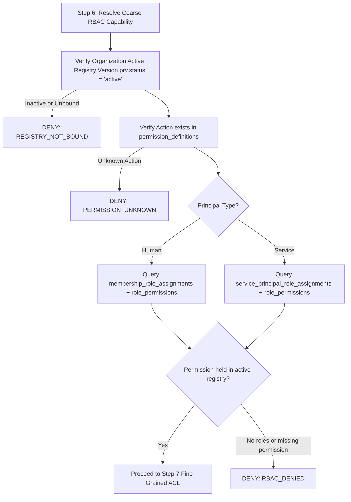

# ADR-002: Service Principal Role-Based Access Control (RBAC) & Step 6 Evaluation

**Status**: PROPOSED (Target: Architecture v2.3)  
**Date**: 2026-08-28  
**Author**: Deep Builder (`anthropic/claude-sonnet-5`)  
**Scope**: Oryol Core Identity, Tenancy, and Authorization Engine  
**Affected Documents**: `authorization-model.md`, `multi-tenancy.md`, `identity-model.md`

---

## 1. Context

Oryol Architecture v2.2 establishes a strict binary principal taxonomy in `identity-model.md §2`:
1. **Human Principals**: Authenticated individuals bound to organizations via `memberships`.
2. **Service Principals**: Automated workloads, backend daemons, and programmatic integrations bound to organizations via `organization_service_principals`.

In the authorization algebra (`authorization-model.md §5`):
- **Step 1** validates `principals.status = 'active'`.
- **Step 2** validates `memberships.status = 'active'` (for humans) or `organization_service_principals.status = 'active'` (for service principals).
- **Step 5** evaluates `explicit_denies` matching `authorization_subjects` (which explicitly supports `subject_type = 'service_principal'`).
- **Step 6** resolves coarse RBAC capability against the organization's active `permission_registry_versions`.

---

## 2. Problem Statement (`ARCHITECTURE_SCHEMA_CONTRADICTION #2`)

During Phase 1 — Slice 3 implementation of the authorization engine, a schema contradiction was discovered:
1. In canonical Phase 1 migrations `0001` through `0004`, coarse-RBAC role assignments exist **exclusively** for human memberships via `membership_role_assignments (organization_id, membership_id, role_id)`.
2. The schema contains **no table** for assigning roles to service principals (e.g. `service_principal_role_assignments`).
3. In Step 6 coarse-RBAC evaluation, when a request is made by a service principal, the engine queries role assignments for `resolvedMembershipId`. Because a service principal has no membership record (`resolvedMembershipId === null`), no roles can be resolved.
4. Consequently, every service principal authorization request inevitably terminates at Step 6 with **`DENY(RBAC_DENIED)`**. While fail-closed, this made service principals structurally incapable of holding permissions or performing authorized actions in Phase 1.

---

## 3. Decision

We introduce explicit, tenant-bound service principal role assignments in D1, establishing unified coarse-RBAC capability resolution across both human and service principal identities.

### 3.1 Persistence Model

A dedicated, normalized role assignment table is introduced:

#### Table: `service_principal_role_assignments`
```sql
CREATE TABLE service_principal_role_assignments (
    id TEXT PRIMARY KEY,                       -- sra_<ulid>
    organization_id TEXT NOT NULL REFERENCES organizations(id) ON DELETE CASCADE,
    organization_service_principal_id TEXT NOT NULL,
    role_id TEXT NOT NULL,
    created_at DATETIME DEFAULT CURRENT_TIMESTAMP,
    FOREIGN KEY (organization_id, organization_service_principal_id)
        REFERENCES organization_service_principals(organization_id, id) ON DELETE CASCADE,
    FOREIGN KEY (organization_id, role_id)
        REFERENCES role_definitions(organization_id, id) ON DELETE CASCADE,
    UNIQUE(organization_id, organization_service_principal_id, role_id),
    UNIQUE(organization_id, id)
);

CREATE INDEX idx_sra_osp ON service_principal_role_assignments(organization_id, organization_service_principal_id);
CREATE INDEX idx_sra_role ON service_principal_role_assignments(organization_id, role_id);
```

#### Key Properties:
1. **Compound Tenant Isolation**: Universal compound foreign keys enforce that:
   - `organization_service_principal_id` belongs to the exact same `organization_id`.
   - `role_id` belongs to the exact same `organization_id` (or is an active system template role).
2. **Compound Uniqueness**: `UNIQUE(organization_id, organization_service_principal_id, role_id)` prevents duplicate assignments of the same role to a service principal within an organization.
3. **No Identity Conflation**: Service principals are never assigned synthetic `memberships` records.

---

### 3.2 Canonical Step 6 Unified RBAC Evaluation Algebra

Step 6 resolves coarse capabilities uniformly based on principal type:



#### Resolution Algorithm:
1. Query `organization_permission_registries` for `organization_id` joined with `permission_registry_versions prv WHERE prv.status = 'active'`.
   If no active bound registry $\to$ **`DENY(REGISTRY_NOT_BOUND)`**.
2. Query `permission_definitions` for `(registry_version, action)`.
   If action does not exist $\to$ **`DENY(PERMISSION_UNKNOWN)`**.
3. Resolve assigned roles based on principal taxonomy:
   - **For `principal.type = 'human'`**:
     ```sql
     SELECT rp.permission_name, rd.name as role_name, rd.is_system_template
     FROM membership_role_assignments mra
     JOIN role_definitions rd ON rd.organization_id = mra.organization_id AND rd.id = mra.role_id
     JOIN role_permissions rp ON rp.organization_id = rd.organization_id AND rp.role_id = rd.id
     WHERE mra.organization_id = ?
       AND mra.membership_id = ?
       AND rp.registry_version = ?
       AND rp.permission_name = ?;
     ```
   - **For `principal.type = 'service'`**:
     ```sql
     SELECT rp.permission_name, rd.name as role_name, rd.is_system_template
     FROM service_principal_role_assignments sra
     JOIN role_definitions rd ON rd.organization_id = sra.organization_id AND rd.id = sra.role_id
     JOIN role_permissions rp ON rp.organization_id = rd.organization_id AND rp.role_id = rd.id
     WHERE sra.organization_id = ?
       AND sra.organization_service_principal_id = ?
       AND rp.registry_version = ?
       AND rp.permission_name = ?;
     ```
4. If no matching role permission exists $\to$ **`DENY(RBAC_DENIED)`**.
5. If matching role permission exists $\to$ PROCEED to Step 7 with resolved role capabilities.

---

### 3.3 Strict Evaluation Invariants

1. **Shared Registry & Role Definitions**:
   Service principals evaluate against the **exact same** `permission_definitions`, `role_definitions`, and `role_permissions` as human members. No bespoke "service-only" permission registry is introduced.
2. **Explicit Deny Precedence (Step 5)**:
   Explicit denies configured on service principals (`authorization_subjects WHERE subject_type = 'service_principal'`) execute at Step 5 and unconditionally override any role permission granted via `service_principal_role_assignments`.
3. **Step 7 Fine-Grained Resource Evaluation**:
   - Organization-wide non-resource actions (e.g. `mail.messages.send`) succeed upon passing Step 6 coarse-RBAC and Step 8 contextual ABAC.
   - Privately owned resources (`resource.owner_membership_id !== null`) require explicit resource grants (`resource_grants`) or unowned resource status. Service principals holding system template Admin/Owner roles bypass private ACLs identically to human administrators.
4. **Authentication vs. Authorization Separation**:
   This ADR defines authorization state and evaluation only. How a service principal authenticates (API keys, mTLS, client credentials) is managed by dedicated authentication slices. The authorization engine receives an already-authenticated principal and verifies rights authoritatively in D1.

---

## 4. Policy Mutation & Version Invalidation

1. **Monotonic Version Invalidation**:
   - Assigning a role to a service principal (`assignServicePrincipalRole`) MUST increment `authorization_versions.version`.
   - Removing a role from a service principal (`removeServicePrincipalRole`) MUST increment `authorization_versions.version`.
2. **Atomic Batch Guarantee**:
   All service principal role mutations execute in a single atomic D1 transaction (`db.batch()`) containing:
   - The role assignment `INSERT` or conditional `DELETE`.
   - The conditional `authorization_versions` increment (`INSERT...ON CONFLICT DO UPDATE SET version = version + 1 WHERE EXISTS (...)`).
   - The immutable audit event (`core.rbac.service_principal_role_assigned` / `core.rbac.service_principal_role_removed`).
   - The transactional outbox event.
3. **No-Op Atomicity**:
   Removing a non-existent service principal role assignment is a strict no-op: 0 rows deleted, 0 version increments, 0 audit logs, and 0 outbox events.

---

## 5. Alternatives Considered & Rejected

1. **Synthesizing Fake Human Memberships for Service Principals**:
   - *Rejected*: Violates binary principal taxonomy in `identity-model.md §2`. Memberships represent human employment/invitation lifecycles and require user profiles. Conflating services with human memberships creates security audit confusion and breaks GDPR/privacy redaction pipelines.
2. **Hardcoded Administrative Bypass for Service Principals**:
   - *Rejected*: Severe violation of least privilege. Service principals must be restricted to explicitly assigned roles.
3. **Embedding Role Claims Inside Service Principal API Tokens / JWTs**:
   - *Rejected*: Violates `authorization-model.md §6.3` (*"Privileges resolved strictly server-side"*). Token-embedded roles cannot be invalidated instantaneously upon role revocation. D1 role assignments are authoritative.
4. **Polymorphic `role_assignments` Table with Subject Type Discrimination**:
   - *Rejected*: SQLite/D1 does not support conditional foreign keys on a single polymorphic column. Separate tables `membership_role_assignments` and `service_principal_role_assignments` maintain strict database-enforced relational integrity via compound foreign keys.

---

## 6. Security Consequences

- **Fail-Closed Default**: A service principal without an explicit role assignment continues to be denied access with `DENY_RBAC_DENIED`.
- **Tenant Confinement**: Service principals can only be assigned roles within their own organization; compound foreign keys prevent cross-tenant role binding.
- **Audit Traceability**: All service principal role assignments and mutations are recorded with structured actor context and aggregate ordering.

---

## 7. Schema & Migration Impact

- **Migration**: Included in Migration `0005_core_security_policies_and_service_rbac.sql`.
- **Accepted Migrations `0001`–`0004`**: Remain **sealed and unmodified**.
- **Backward Compatibility**: Fully backward compatible. Existing human membership RBAC is unchanged. Newly provisioned service principals fail closed until explicitly assigned a role.
