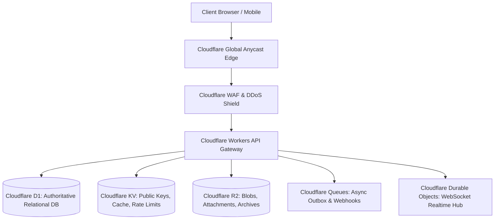

# Oryol Cloudflare Platform Architecture v2.2

**Status**: CANONICAL ARCHITECTURE BASELINE (v2.2)  
**P0 Remediation**: Phase Rollout Mapping, Edge Storage Roles & Operational Constraints

---

## 1. Edge Topology & Storage Roles

Oryol Workspace leverages the Cloudflare Developer Platform stack, mapping concerns to the optimal edge primitives:

---

## 2. Phased Rollout Mapping & Storage Rules

| Cloudflare Primitive | Rollout Phase | Role in Oryol Architecture | Strict Usage Constraint |
|---|---|---|---|
| **Cloudflare Workers** | **Phase 1 (MVP)** | Stateless edge compute, request routing, local Ed25519 JWT verification. | No persistent in-memory global state across invocations. |
| **Cloudflare D1 (SQLite)** | **Phase 1 (MVP)** | Authoritative relational data (principals, orgs, memberships, sessions, outbox). | Mandatory parameterized queries and compound tenant scoping. |
| **Cloudflare KV** | **Phase 1 (MVP)** | Fast read cache (cached public keys, rate-limiting tokens, temp OTP nonces). | **Never** authoritative security or session state. |
| **Cloudflare Queues** | **Phase 2** | Asynchronous outbox processing, audit event ingestion, inbound email pipeline. | At-least-once delivery; consumers must be idempotent (`inbox_events`). |
| **Cloudflare R2** | **Phase 2** | Binary asset storage (email attachments, drive documents, cold audit exports). | Partitioned by `/org_{org_id}/...`. Pre-signed URLs < 15m TTL. |
| **Cloudflare Vectorize** | **Phase 3** | Secondary search embedding index for fast similarity lookup. | Derived read model only; live authorization required before exposure. |
| **Durable Objects** | **Phase 3** | WebSocket coordination for live notifications and collaborative editing. | Bound to specific user or organization coordinator instances. |

---

## 3. Pilot D1 Performance & Operational Thresholds

- **Query Latency Targets**: p50 < 5ms, p95 < 25ms, p99 < 100ms.
- **Write Contention**: Max 3 retry attempts, lock wait budget < 50ms.
- **Error Budget**: Query error rate < 0.01%.
- **Storage Limit**: 5 GB per D1 shard threshold for triggering `organization_placement` re-sharding.
