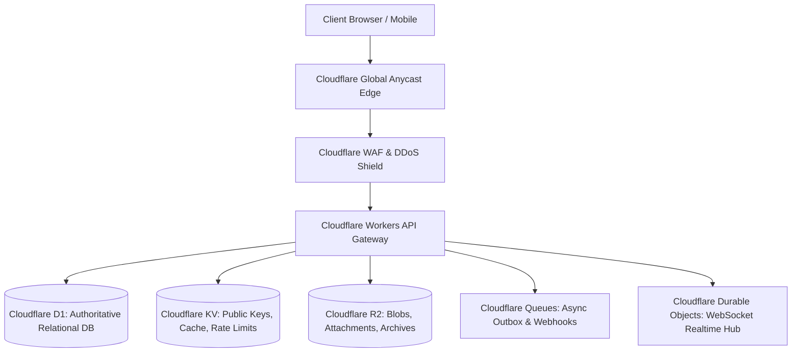

# Oryol Cloudflare Platform Architecture v2

**Status**: CANONICAL ARCHITECTURE BASELINE (v2)  
**Supersedes**: `knowledge/oryol/backend.md` (v1)

---

## 1. Edge Topology & Storage Roles

Oryol Workspace leverages the full Cloudflare Developer Platform stack, mapping concerns to the optimal edge primitives:

---

## 2. Component Storage Mapping & Rules

| Cloudflare Primitive | Role in Oryol Architecture | Strict Usage Constraint |
|---|---|---|
| **Cloudflare Workers** | Stateless edge compute, request routing, local Ed25519 JWT verification. | No persistent in-memory global state across invocations. |
| **Cloudflare D1 (SQLite)** | Authoritative relational data (principals, orgs, memberships, sessions, outbox). | Mandatory parameterized queries and tenant scoping. |
| **Cloudflare KV** | Fast read cache (cached public keys, rate-limiting tokens, temp OTP nonces). | **Never** authoritative security or session state. |
| **Cloudflare R2** | Binary asset storage (email attachments, drive documents, cold audit exports). | Partitioned by `/org_{org_id}/...`. Pre-signed URLs < 15m TTL. |
| **Cloudflare Queues** | Asynchronous outbox processing, audit event ingestion, inbound email pipeline. | Guaranteed at-least-once delivery; consumers must be idempotent. |
| **Durable Objects** | WebSocket coordination for live notifications and collaborative editing. | Bound to specific user or organization coordinator instances. |
