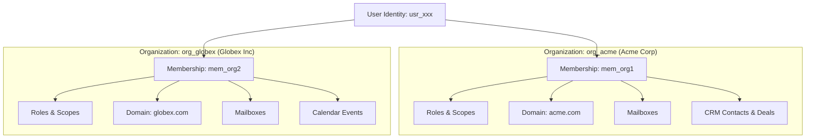

# Oryol Workspace Architecture & System Rules

Oryol Workspace is a unified, privacy-first enterprise productivity ecosystem designed to integrate business communication, customer relationships, scheduling, documents, and private intelligence under a single organization-centric multi-tenant model.

---

## 1. Permanent Workspace Architecture Rules

Every product, service, module, and integration within the Oryol ecosystem must adhere unconditionally to the following seven architectural rules:

### Rule 1: Every Oryol product belongs to Oryol Workspace
No application operates as an isolated island or standalone silo. Every product (OryolMail, Oryol CRM, Oryol Calendar, Oryol Drive, Virel) is a specialized capability within the unified Oryol Workspace platform.

### Rule 2: Every business object belongs to an Organization
Direct user-to-data associations are strictly prohibited. 

```
NEVER:
  User ──► Business Object (e.g. Email, Contact, File, Event)

ALWAYS:
  User
    │
  Membership (Role, Scopes, State)
    │
  Organization (Tenant Boundary, Custom Domains, Policies)
    │
  Business Object (Mailbox, Thread, Lead, Calendar, Asset)
```

- Organizations are the hard security and data isolation boundary.
- Users participate in organizations solely via **Memberships**.
- A user may hold memberships in multiple organizations; switching organizations switches the active tenant context entirely.

### Rule 3: Centralized Authentication
Products must **never** create isolated login systems, custom credentials tables, bespoke password-hashing schemes, or fragmented session cookies.
- Authentication is managed centrally by the Oryol Identity Service.
- Products consume validated session tokens and organization-scoped identity claims.

### Rule 4: Centralized Authorization & Permissions
Permissions and roles are defined and evaluated through the centralized workspace authorization model.
- Permissions follow explicit dot-notation namespaces (e.g., `mail.read`, `mail.send`, `crm.deal.manage`, `admin.domain.verify`).
- Services and endpoints must verify membership permissions before executing any state or data operation.

### Rule 5: Audit Events on Sensitive Actions
Every state-mutating, access-delegating, or security-sensitive action must generate an immutable, structured **Audit Event**.
- Required fields: `timestamp`, `organization_id`, `actor_id`, `actor_membership_id`, `action`, `resource_type`, `resource_id`, `ip_address`, `client_metadata`, `status`.
- Audit trails are organization-scoped and tamper-evident.

### Rule 6: Permission-Aware AI
Artificial Intelligence agents, summarizers, classifiers, and copilots must operate strictly within the authenticated user's active organization and permission envelope.
- AI must never cross organization boundaries or bypass document-level ACLs.
- AI actions must be previewable, permission-verified, and attributed in the audit ledger.

### Rule 7: Shared Platform Services
Products share common foundational platform infrastructure rather than reinventing bespoke wheels:
- Common Domain Management & DNS Diagnostics
- Central Notification & Toast Pipeline
- Unified Search & Entity Indexing
- Centralized Storage (R2) & Relational Edge Persistence (D1)
- Shared Command Palette & Design System

---

## 2. Organization Isolation Model



Every database query, KV access, and message queue payload must include an explicit `organization_id` predicate. Cross-tenant leakage is treated as a critical security defect (P0).
